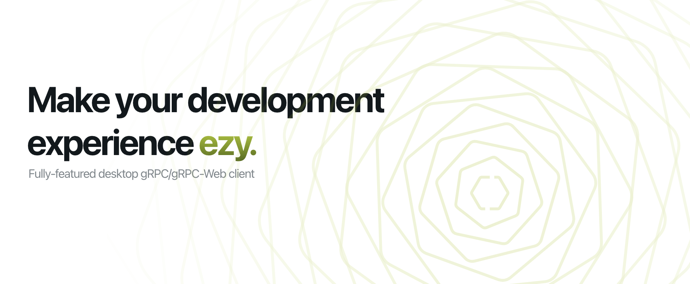

<br />
<div align="center">
  <picture>
  
  </picture>
</div>
<div align="center">
<br />

  [](https://www.codacy.com/gh/getezy/ezy/dashboard?utm_source=github.com&amp;utm_medium=referral&amp;utm_content=getezy/ezy&amp;utm_campaign=Badge_Grade)
  [](https://github.com/getezy/ezy/releases/latest)
  [](https://discord.gg/r26ETPgj6R)

</div>

Fully-featured desktop gRPC/gRPC-Web client.

<div align="center">
  
</div>
<br />

🚧 This project is in beta phase and can get breaking changes at any time until it goes to v1.

## Features
✅ Tabs  
✅ Shortcuts  
✅ Environments  
✅ Persisted collections  

|                                                           	| gRPC 	|                            gRPC-Web                   |
|-----------------------------------------------------------	|:----:	|:-------------------------------------------------------------:	  |
| Unary Calls                                               	|   ✅  	|                               ✅                               	|
| Server Streaming                                          	|   ✅  	|                               ✅                               	|
| Client Streaming                                          	|   ✅  	| ❌ [read](https://github.com/grpc/grpc-web/blob/master/doc/streaming-roadmap.md#client-streaming-and-half-duplex-streaming) 	  |
| Bi-directional Streaming                                  	|   ✅  	| ❌ [read](https://github.com/grpc/grpc-web/blob/master/doc/streaming-roadmap.md#full-duplex-streaming-over-http) 	  |
| Stream cancelation                                        	|   ✅  	|                               ✅                               	|
| Metadata                                                  	|   ✅  	|                       ✅ Browser Headers                       	|
| TLS (Server-side/Mutual) with CA/Self-Signed certificates 	|   ✅  	|                               ✅                               	|

## Getting started
Install the latest version for your OS from [release page](https://github.com/getezy/ezy/releases/latest).

Today you can update only by manually downloading new app version and reinstalling it. I'm working on automatic updates.

## Shortcuts

Use `⌘+K` (macOS) or `Ctrl+K`(Windows/Linux). Just try it.

## Working with 64-bit integers
If you want to send 64-bit integers (`int64`, `uint64`, `sint64`, `fixed64`, `sfixed64`) just wrap values in quotes.

```json
{
  "int64": "9223372036854775807",
  "uint64": "18446744073709551615",
  "sint64": "-9223372036854775807",
  "fixed64": "18446744073709551615",
  "sfixed64": "-9223372036854775807"
}
```

## Build from source

```bash
  $ npm ci
  $ npm run make
```

## Roadmap

Actual roadmap available [here](https://github.com/orgs/getezy/projects/1/views/1).

## Sponsorship

If you are interested in sponsorship of this project - shoot me an [email](mailto:vasyukov.alexey.v@gmail.com). I have great ideas on how we can improve gRPC (and not only!) development experience. I'll be glad to talk about it.

## License
Mozilla Public License Version 2.0
