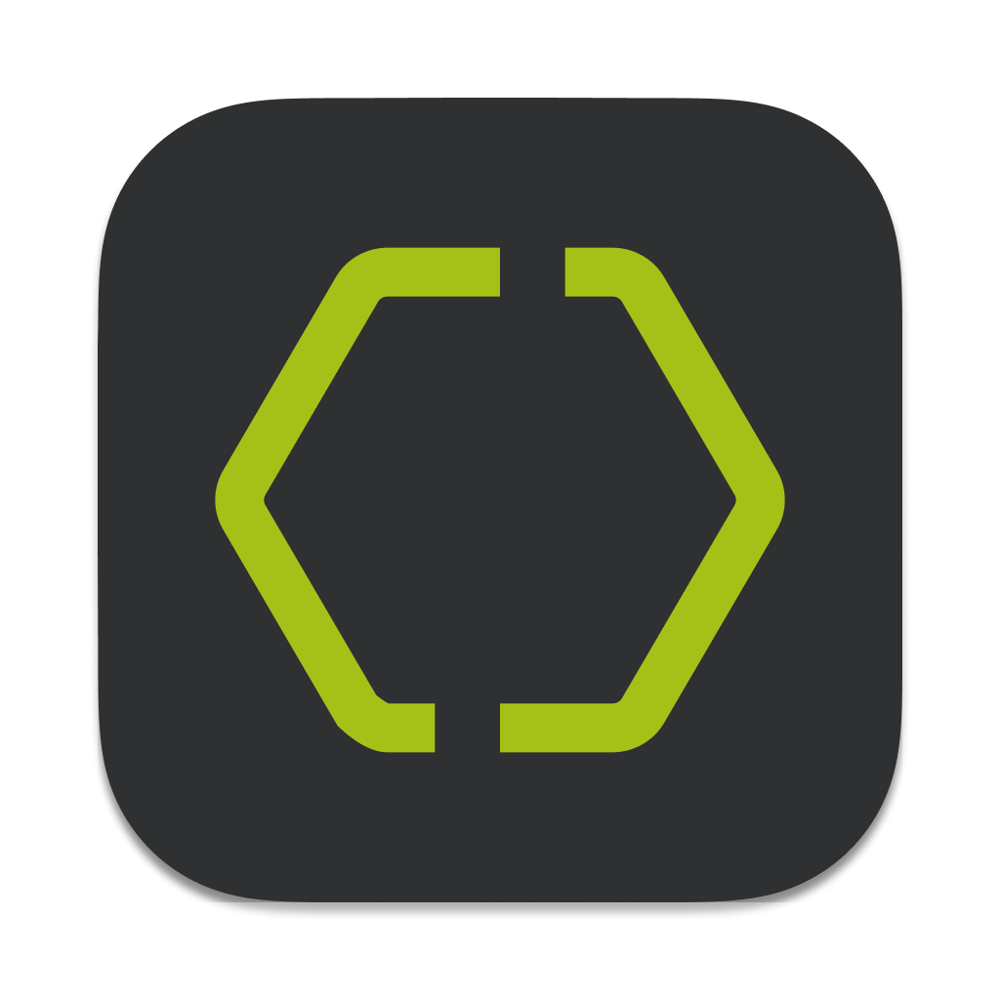

 

  <picture>
    
  </picture>

  
  
  <!--   -->
  <!-- 
   -->

`ezy` - desktop gRPC client.

⚠️ **WARNING!** This project is in beta phase and can get breaking changes at any time until it goes to v1. 🏗

## Features
✅ Localy persisted collections.  
✅ Multi-tabs.  
✅ Environments.  

**gRPC**  
✅ Unary calls.  
✅ Client/Server/Bidirectional streaming.  
✅ Metadata support.  
✅ TLS (Server-side/Mutual) support.  
✅ Good errors output.  

# Preview

## Getting started
Install the latest version for your OS from [release page](https://github.com/getezy/ezy/releases/latest).

Today you can update only by manually downloading new app version and reinstalling it. I'm working on automatic updates.

## Roadmap

Actual roadmap available [here](https://github.com/orgs/getezy/projects/1/views/1).

## License
Mozilla Public License Version 2.0
